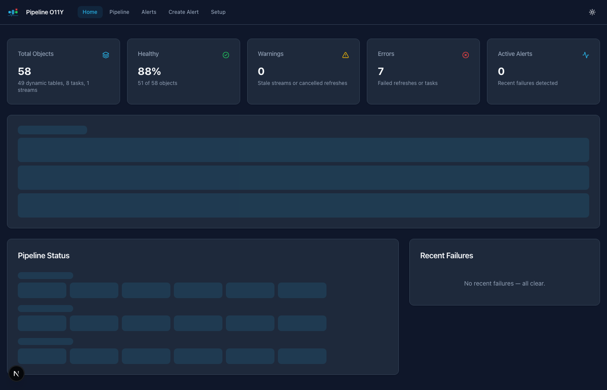
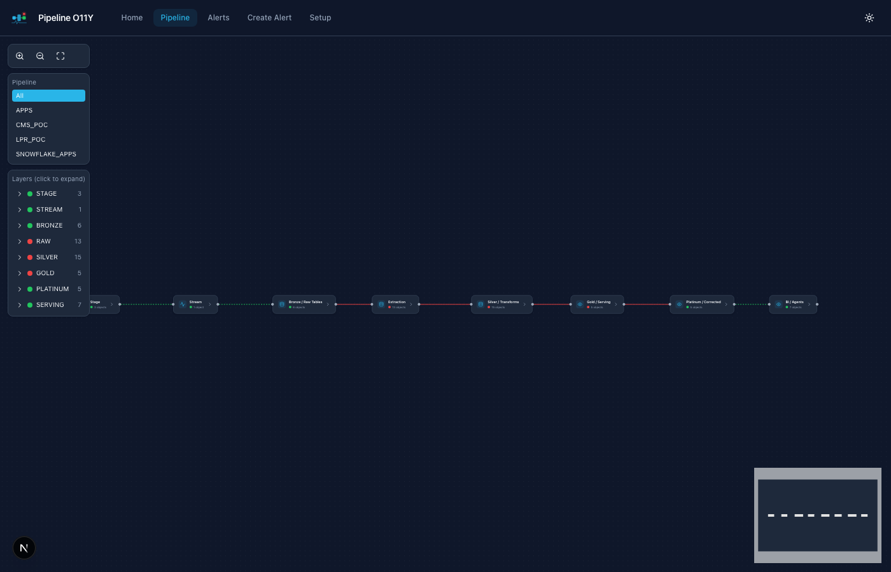

# Pipeline O11Y

End-to-end pipeline health monitoring, visualization, and alerting for Snowflake — deployed as a Snowflake App Runtime application.

Tag your pipeline objects with `o11y` and this app surfaces their health in a single pane of glass: interactive flow diagrams, real-time status, anomaly detection, and one-click alert creation.





## Features

- **Home Dashboard** — KPI health cards, status grid grouped by object type, recent failures, anomaly detection
- **Pipeline Visualization** — Interactive left-to-right DAG with collapsible layer groups, color-coded nodes (green/yellow/red), hover-to-focus, click-through detail panels with columns, row counts, and refresh history
- **Alert History** — Timeline of alert events with severity filters, anomaly panel, monitored object summary
- **Create Alerts** — Step-by-step alert builder: pick object type → pick object → pick condition → configure schedule and email. SQL preview before execution. Create alerts directly from the pipeline detail panel.
- **Setup** — Tag configuration, pre-made Cortex Code prompts for tagging pipelines, app instructions

## Supported Object Types

| Object | Health Source | What's Monitored |
|---|---|---|
| Dynamic Tables | `INFORMATION_SCHEMA.DYNAMIC_TABLES()`, refresh history | Scheduling state, refresh success/failure, lag ratio, row counts |
| Tasks | `SHOW TASKS` | Started/suspended state |
| Streams | `SHOW STREAMS` | Staleness |
| Stages | Directory tables | File counts, last modified |
| Semantic Views | `SHOW SEMANTIC VIEWS` | Existence and availability |
| App Services | `SHOW APPLICATION SERVICES` | Running status |

## Setup — Deploy with Cortex Code

> **Prerequisites:** ACCOUNTADMIN role (or a role with CREATE APPLICATION SERVICE, USAGE on a warehouse, and access to the databases you want to monitor).

Open Cortex Code and paste:

```
Deploy the Pipeline O11Y app from ~/CoCoProjects/pipeline-o11y to my Snowflake account.
Use database SNOWFLAKE_APPS, schema PUBLIC, warehouse COMPUTE_WH.
```

Or manually:

```bash
cd ~/CoCoProjects/pipeline-o11y
snow app setup --app-name="PIPELINE_O11Y" --warehouse="COMPUTE_WH"
snow app deploy --entity-id pipeline_o11y
```

### Tagging Your Pipeline

The app discovers objects via the `o11y` tag. Tag your pipeline components with Cortex Code:

```
Tag every component of MY_DATABASE with the tag o11y.
Create the tag in MY_DATABASE.PUBLIC if it doesn't exist.
```

Or manually:

```sql
CREATE TAG IF NOT EXISTS MY_DATABASE.PUBLIC.O11Y COMMENT = 'Pipeline observability';
ALTER DYNAMIC TABLE MY_DATABASE.SCHEMA.MY_DT SET TAG MY_DATABASE.PUBLIC.O11Y = 'MY_DATABASE';
```

## Extend It

Ideas for improving the app with Cortex Code:

- *"Add Openflow connector health monitoring to the pipeline view"*
- *"Add a Slack webhook notification option to the alert builder"*
- *"Add a cost-per-refresh column to the dynamic table detail panel"*
- *"Create a scheduled report that emails a daily health summary"*

## Architecture

- **Next.js 16** + React 19 + TypeScript on Snowflake App Runtime
- **@xyflow/react** + dagre for interactive pipeline DAG visualization
- **Tailwind CSS 4** + shadcn/ui with Snowflake brand theming (dark mode default)
- **Server-side caching** (60s topology, 45s health, 90s anomalies) for fast repeat loads
- Queries run inside Snowflake's network — no data leaves the account

## Configuration

Environment variables in `app.yml`:

| Variable | Default | Description |
|---|---|---|
| `DEFAULT_O11Y_TAG` | `o11y` | Tag name used to discover pipeline objects |
| `O11Y_TAG_DATABASE` | `LPR_POC` | Database where the tag is defined |
| `O11Y_TAG_SCHEMA` | `OPS` | Schema where the tag is defined |

## Local Development

```bash
npm install
SNOWFLAKE_CONNECTION_NAME=<your-connection> npm run dev
```

The app runs at `http://localhost:3000` and reads credentials from your Snowflake CLI connection in `~/.snowflake/config.toml`.

## Disclaimer

**Disclaimer:** This app is provided as a sample resource for your convenience.
It is not officially supported by Snowflake and is provided "as is," without
warranty or liability. Please review the code and validate it for your use case
before deploying in a production environment.
